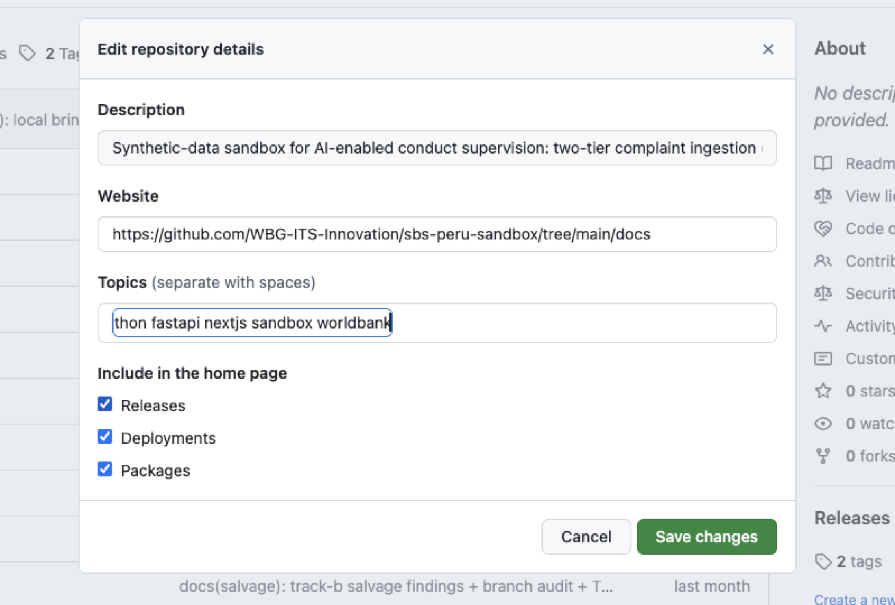
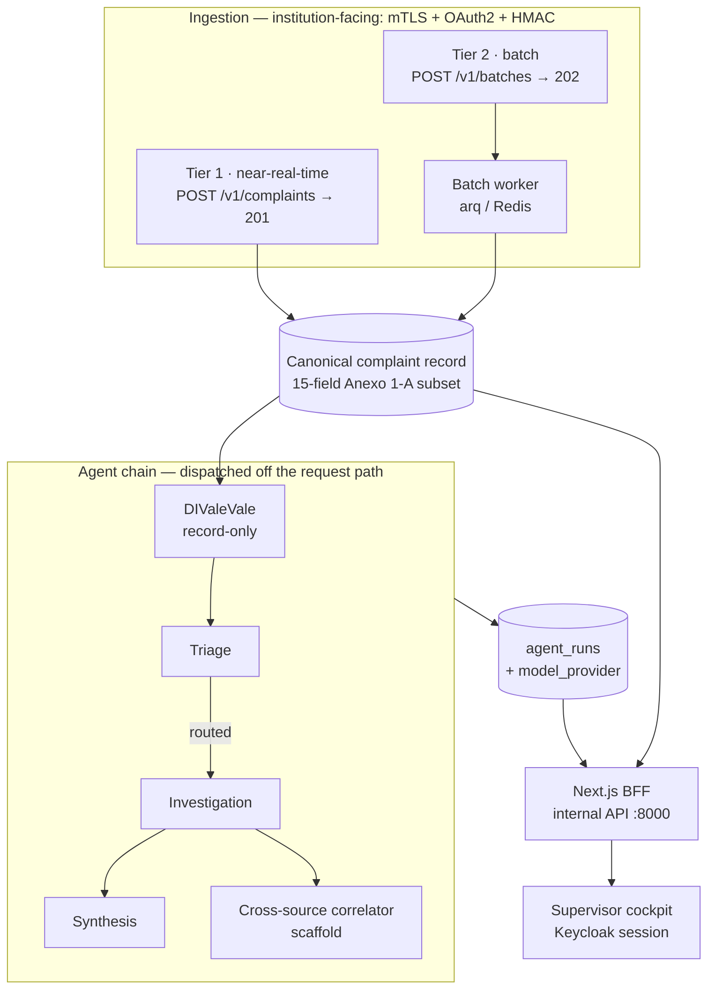

# SBS SupTech Sandbox — AI-Enabled Conduct Supervision

An AI-enabled conduct-supervision sandbox for consumer-complaint analytics, built by the World Bank ITS Technology & Innovation Office (ITSTI) in support of an engagement with Peru's financial regulator, the Superintendencia de Banca, Seguros y AFP (SBS). It shows how a supervisory authority could receive complaint data from supervised institutions over an authenticated channel, run an auditable multi-agent analytics pipeline over it, and put the results in front of a human supervisor who stays accountable for every decision. It is open-sourced as a reference implementation for financial authorities and their vendors exploring SupTech, and runs entirely on synthetic data.

This is a prototype for demonstration and reuse, not an official SBS system, and it contains no SBS data.



## What this demonstrates

Each item below is implemented and exercised; where the shipped behaviour is
narrower than the design, the limitation is named here and detailed in
[docs/HANDOVER-NOTES.md](docs/HANDOVER-NOTES.md).

- **Two-tier ingestion behind a real auth chain.** A near-real-time single-complaint API (`POST /v1/complaints`) and an authenticated batch channel (`POST /v1/batches`), both behind mutual TLS, OAuth2 client-credentials with cert-bound tokens, and HMAC body signing, plus per-institution rate limiting and idempotency. Both tiers land as the same canonical record.
- **A supervised multi-agent pipeline** — validation (DIValeVale) → triage → conditional investigation → synthesis → cross-source correlation — running on both ingestion tiers, off the request path. Agents orchestrate, ten deterministic tools execute, and a human supervisor approves before anything reaches an institution.
- **A per-run provider audit trail.** Every agent run persists an `agent_runs` row recording which provider *actually served* it, so a replayed fixture can never be mistaken for live inference. The chain has been demonstrated end-to-end against live cloud inference (Azure OpenAI) on synthetic data.
- **Pluggable model providers** — `on_prem` (self-hosted vLLM; the default and the target state), `cloud` (Azure OpenAI, behind a legal opt-in), `replay` (deterministic demos), and a test-only `mock`. No provider ever silently substitutes for another: a misconfigured one fails at boot rather than fabricating analysis.
- **A supervisor cockpit** — a Next.js application with a Keycloak-backed session, three demo personas, and a two-perimeter identity model that keeps the institution-facing and supervisor-facing channels separate by design.
- **A ten-stage verification gate suite** (`stage-a` … `stage-h-full`), where the `-full` gates run against the live compose stack with no mocks, and the complete evidence trail is committed under [docs/audit/](docs/audit/).

Read [docs/ARCHITECTURE.md](docs/ARCHITECTURE.md) for how each of these actually works, cited to the code.



## Getting started

Prerequisites: Docker + Docker Compose, Python 3.12 with [uv](https://docs.astral.sh/uv/), Node.js 20+ (for the web app under `app/`), bash, and openssl (for the local dev CA).

A fresh clone reaches a working signed-request stack in three commands:

```bash
# 1. Bring up Postgres + Redis, apply migrations, seed institutions +
#    HMAC secrets, generate the dev CA + leaf certs, seed oauth_clients.
bash scripts/dev-up.sh

# 2. Run the API with mTLS direct mode + the real auth chain, on :8443
#    (the port step 3 and the dev certs' SANs both expect):
SBS_API_MTLS_MODE=direct \
SBS_API_AUTH_STUB_ENABLED=false \
SBS_API_PORT=8443 \
  bash scripts/run-api.sh

# 3. Smoke-test the full signed-request path end-to-end:
bash scripts/smoke-test-auth.sh
```

The legacy auth-stub path is still supported for tests and any local-only
work that does not exercise mTLS:

```bash
bash scripts/dev-up.sh
bash scripts/run-api.sh          # AUTH_STUB_ENABLED=true by default
bash scripts/smoke-test.sh
```

Run `make help` for the full set of convenience targets (tests, smoke suite, corpus regeneration, developer portal, standards pack).

## Run the supervisor cockpit

The cockpit is a separate Next.js app under `app/`. It needs **two API processes**, because the institution-facing channel and the internal channel have deliberately different auth postures:

| Process | Port | Posture | Serves |
|---|---|---|---|
| Institution-facing API | `8443` | mTLS direct, real auth chain, `SBS_API_AUTH_STUB_ENABLED=false` | `POST /v1/complaints`, `POST /v1/batches` — everything an institution calls |
| Internal API | `8000` | Plain HTTP, auth stub on, shared-secret bearer on `/v1/internal/*` | The cockpit's server-side fetches (Next.js → FastAPI, server-to-server) |

Running only the `8443` process leaves the cockpit unable to reach a backend and `/app/cockpit` returns **HTTP 500** with `fetch failed`. That is the most common way to get a broken-looking cockpit.

```bash
# 1. Postgres + Redis + migrations + seeds (as above), plus Keycloak —
#    the supervisor session is Keycloak-backed per ADR 0040. The realm
#    'sbs-demo' is imported automatically from infra/keycloak/.
bash scripts/dev-up.sh
docker compose up -d keycloak

# 2. Institution-facing API on :8443 — step 2 above, plus the agent
#    pipeline, so submitted complaints get an agent chain to show.
SBS_API_MTLS_MODE=direct \
SBS_API_AUTH_STUB_ENABLED=false \
SBS_API_PORT=8443 \
SBS_API_AGENTS_PIPELINE_ENABLED=true \
SBS_API_MODEL_PROVIDER=replay \
  bash scripts/run-api.sh

# 3. Internal API on :8000, in a second terminal. This is the one the
#    cockpit talks to; the auth-stub default is what you want here.
SBS_API_PORT=8000 bash scripts/run-api.sh

# 4. Cockpit env. The shared secret must MATCH on both sides:
#    app/.env.local          SBS_INTERNAL_API_SECRET
#    the FastAPI processes   SBS_API_INTERNAL_API_SECRET   (root .env)
cp app/.env.example app/.env.local
# then edit app/.env.local — see the comments in app/.env.example

# 5. Run the cockpit.
cd app && npm install && npm run dev
```

**Why step 2 sets `SBS_API_MODEL_PROVIDER=replay`.** Enabling the agent pipeline arms a boot healthcheck that refuses to start the API unless the model provider can serve a canary tool-call; the `on_prem` default expects a vLLM endpoint at `localhost:8001`, so without one the process exits with `provider.healthcheck.failed` instead of listening on `:8443`. `replay` is fixture-backed and deterministic, skips the canary, and logs a warning on every request naming itself a replay — the demo posture, chosen over fabricating analysis. See [docs/ARCHITECTURE.md](docs/ARCHITECTURE.md) §3 for the provider semantics.

`SBS_API_AGENTS_PIPELINE_ENABLED` defaults to **off**, so a `:8443` process started without it ingests complaints normally but writes no `agent_runs` — the cockpit renders the complaint with an empty agent chain. The Tier-2 equivalent is a separate flag on the worker container; see [docs/HANDOVER-NOTES.md](docs/HANDOVER-NOTES.md) under "Operating the stack".

Then open the demo-mode session bootstrap, which acquires Keycloak tokens for the three demo personas and redirects to the cockpit:

<http://localhost:3000/app/api/auth/demo-login>

The cockpit itself is at **<http://localhost:3000/app/cockpit>** (`/supervisor` is not a route and 404s). `SBS_DEMO_MODE=true` is what exposes `demo-login`; with it off the route returns 404 and you log in through Keycloak normally at `/app/login`.

See [app/README.md](app/README.md) for the route map and [docs/HANDOVER-NOTES.md](docs/HANDOVER-NOTES.md) for the operational caveats worth knowing before a demo.

The canonical OpenAPI YAML is served at `/v1/openapi.yaml`. FastAPI's auto-generated `/openapi.json`, `/docs`, and `/redoc` are disabled per ADR 0028 §6 — the curated YAML is the contract. The running API also serves the rendered developer portal at `/v1/portal/` (Stoplight Elements, vendored locally per ADR 0037, no CDN dependency).

## Architecture

Three layers per [ADR 0001](docs/adr/0001-three-layer-mcp-a2a-langgraph.md) (Accepted): **agents** orchestrate, **tools** execute, **supervisors** approve. Specialist agents (triage, investigation, synthesis, plus a scaffolded cross-source correlator) drive an in-house tool-calling loop over ten deterministic tools — classification, data-quality validation against the Annex 1-A rule set, feature ranking, anomaly scoring, taxonomy normalization — behind a provider-pluggable model interface. Every run is recorded as an auditable `agent_run` carrying the provider that served it (see [docs/schemas/](docs/schemas/)).

Res. SBS N° 04036-2022 Anexo 1-A defines a 27-field complaint record — 23 base fields plus 4 conditional bancaseguros fields (one trigger, three conditional on it). The institution-facing contract implements a curated 15-field subset of it ([ADR 0026](docs/adr/0026-anexo-1a-curated-subset.md)), validated by 32 deterministic data-quality rules.

**[docs/ARCHITECTURE.md](docs/ARCHITECTURE.md) is the full technical description** — request lifecycle, agent layer, provider abstraction, identity model, verification method, and boundaries. See [docs/adr/](docs/adr/) for all architectural decision records (current head: ADR 0045).

## Data

All complaint records in this repository are synthetic. The committed golden sample (`data/synthetic-corpus-golden/`, 200 rows per demo institution, checksummed manifests) is produced by a seeded, deterministic generator; regenerate with `make corpus-golden`. Demo personas use reserved `@sandbox.example.com` addresses. See [docs/DATA_PROVENANCE.md](docs/DATA_PROVENANCE.md) and ADR 0036 (synthetic-corpus fidelity tiers).

## For institutional integrators

If you are an institution integrating with the SBS sandbox:

1. **Read the portal.** Open `http://<host>/v1/portal/`. The portal renders the canonical OpenAPI 3.1 specification interactively. "Try It" is disabled because mTLS cannot be satisfied from a browser — actual integration uses curl plus the helpers below.

2. **Download the standards pack** as a versioned tarball, with the OpenAPI spec, JSON Schemas, error catalog, webhook-verification helpers, OpenAPI Generator recipes, example payloads, and a provenance manifest:
```bash
   make standards-pack
```
   See [standards-pack/README.md](standards-pack/README.md) for the contents and verification steps.

3. **Use the SDK helpers.** Python integrators install `sdk-helpers/python/` (pure stdlib, Python 3.10+). Node.js integrators install `sdk-helpers/typescript/` (dual ESM + CJS). Both implement the webhook signature verification surface and round-trip against the server's outbound signer in CI. Java and Go integrators use the tested reference snippets at `standards-pack/recipes/webhook-verification-{java,go}.md`; .NET integrators adapt the Java snippet via the `openapi-generator-csharp-netcore.md` recipe.

4. **Try the demo replay.** With docker compose running:
```bash
   docker compose up -d worker webhook-listener
   bash scripts/demo.sh --scale small --seed 20260520
```
   Generates 51 deterministic synthetic complaints (17 per institution × 3 demo institutions), uploads them as Tier 2 batches, polls until each completes, and tails the webhook-listener for the three PASS lines.

Integrator-surface ADRs: [0037 portal serving](docs/adr/0037-developer-portal-serving-mechanism.md) · [0038 SDK helpers](docs/adr/0038-sdk-helper-scope-and-distribution.md) · [0039 standards pack](docs/adr/0039-standards-pack-v0-1-distribution-and-manifest.md).

## Documentation

- [docs/HANDOVER-NOTES.md](docs/HANDOVER-NOTES.md) — **start here.** Operational sharp edges, deliberate limitations, errata against the audit trail
- [docs/ARCHITECTURE.md](docs/ARCHITECTURE.md) — how the system works, cited to the code
- [docs/adr/](docs/adr/) — architectural decision records
- [api/openapi/error-catalog.md](api/openapi/error-catalog.md) — stable error codes
- [docs/DATA_PROVENANCE.md](docs/DATA_PROVENANCE.md) — synthetic-data provenance
- [docs/audit/](docs/audit/) — dated verification reports, kept as an evidence trail
- [docs/demo/institution-api-workflow.md](docs/demo/institution-api-workflow.md) — institution API walkthrough
- [docs/DEPLOY.md](docs/DEPLOY.md) — deployment scaffold
- [CONTRIBUTING.md](CONTRIBUTING.md) — contributor guide
- [SECURITY.md](SECURITY.md) — security policy and private vulnerability reporting

## Citing this work

See [CITATION.cff](CITATION.cff).

## License

This project is licensed under the MIT License together with the World Bank IGO Rider. The Rider is purely procedural: it reserves all privileges and immunities enjoyed by the World Bank, without adding restrictions to the MIT permissions. Please review both files before using, distributing or contributing.

See [LICENSE](LICENSE) and [WB-IGO-RIDER.md](WB-IGO-RIDER.md).

## Contact

World Bank ITS Technology & Innovation Office (ITSTI) — omakhlouk@worldbank.org

General ITSTI enquiries: ITSTIoffice@worldbankgroup.org
