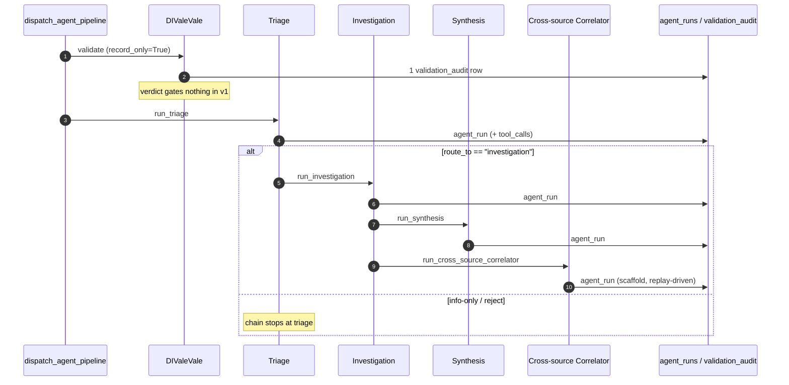

# Architecture

How the sandbox actually works, for a technical reader at a financial
authority or at a vendor building against it. Every claim here points at the
code or the ADR that decides it. Where the shipped behaviour is narrower than
the design, this document says so and links
[HANDOVER-NOTES.md](HANDOVER-NOTES.md), which is the register of deliberate
limitations.

Two conventions worth stating up front. **Near-real-time** means the Tier-1
API accepts a complaint synchronously and runs the analytics chain
immediately afterwards, off the request path — not that analysis is complete
when the caller gets its response. **Scaffold** means a component that ships
its interface and its architectural slot without the capability behind it;
scaffolds are named as such throughout.

---

## 1. Request lifecycle

Two ingestion tiers, one canonical record, one shared agent entry point.

### Tier 1 — signed single complaint

`POST /v1/complaints` ([api/sbs_api/routes/complaints.py](../api/sbs_api/routes/complaints.py)).
The auth chain is four independent checks, each a FastAPI dependency, all of
which must pass before the handler body runs:

| Check | Dependency | Decided by |
|---|---|---|
| mTLS client certificate, matched to a registered institution | [dependencies/mtls.py](../api/sbs_api/dependencies/mtls.py) | [ADR 0031](adr/0031-mtls-client-auth.md) |
| OAuth2 client-credentials bearer token, cert-bound, scope `complaints:write` | [dependencies/oauth.py](../api/sbs_api/dependencies/oauth.py) | [ADR 0032](adr/0032-oauth-client-credentials.md) |
| HMAC signature over the request body | [dependencies/hmac_verify.py](../api/sbs_api/dependencies/hmac_verify.py) | [ADR 0031](adr/0031-mtls-client-auth.md) |
| Per-institution rate limit | [dependencies/rate_limit.py](../api/sbs_api/dependencies/rate_limit.py) | [ADR 0033](adr/0033-rate-limiting-policy.md) |

Idempotency is handled separately ([ADR 0029](adr/0029-idempotency-policy.md)):
a replayed `Idempotency-Key` returns the original stored response rather than
creating a second record.

On success the handler persists the canonical row, marks the idempotency
record complete, and returns **201 + `Location`**. The agent chain is then
dispatched as a Starlette **background task** — that is, after the 201 is
already on the wire:

```python
# api/sbs_api/routes/complaints.py
background=BackgroundTask(dispatch_agent_pipeline, record.complaint_id, tier="tier1")
```

This ordering is deliberate and is the reason for the "near-real-time"
wording. [agents/dispatch.py](../api/sbs_api/agents/dispatch.py) states the two
invariants it exists to hold: the chain **never affects the caller's result**
(every exception is caught and logged there, so a failing agent cannot turn a
successfully-ingested complaint into an error for the institution), and it
runs on its **own session and transaction**, because the request-scoped
session is already closed by the time a background task executes.

### Tier 2 — authenticated batch

`POST /v1/batches` accepts a multipart upload with a manifest and a checksum,
returns **202 + `Location`**, and enqueues work on arq/Redis
([ADR 0034](adr/0034-batch-ingestion-architecture.md)). The worker
([workers/batch_worker.py](../api/sbs_api/workers/batch_worker.py)) validates
row by row, writes accepted rows to the same canonical table, exposes
rejections at `GET /v1/batches/{batch_id}/rejections`, and fires a signed
outbound webhook ([ADR 0035](adr/0035-outbound-webhook-signing-contract.md)).

### Both tiers converge

The worker calls the *same* function the Tier-1 route does, with a different
tier label:

```python
# api/sbs_api/workers/batch_worker.py
await dispatch_agent_pipeline(accepted_id, tier="tier2")
```

So both tiers land as the same canonical `complaints` row and enter the agent
layer through the same door. `tier` is carried into the log line purely so the
two paths stay distinguishable in a trace.

### What the canonical record contains

Resolución SBS N° 04036-2022, Anexo N° 1-A enumerates **27 fields** — 23 base
fields plus a 4-field bancaseguros block: the `BCA_SEG` trigger (campo 24) and
the three fields conditional on it, `producto_bancaseguros` (campo 25),
`motivo_bancaseguros` (campo 26) and `submotivo_bancaseguros` (campo 27), which
apply to institutions distributing insurance through banking channels. The
institution-facing contract implements a curated **15-field subset**, with the
full taxonomy deferred; the subset, the field-by-field mapping to Anexo 1-A,
and the deliberate exclusions (including the four PII-bearing fields) are
tabulated in [ADR 0026](adr/0026-anexo-1a-curated-subset.md). The persisted
`ComplaintRecord` ([db/models/complaint.py](../api/sbs_api/db/models/complaint.py))
carries 29 columns: those 15 plus internal bookkeeping (`source`,
`etag_version`, `received_at`) and resolution/enrichment fields that the batch
tier populates.

Data-quality validation runs 32 deterministic rules over the record — 11
kebab-case rules in [data_quality/checks.py](../api/sbs_api/data_quality/checks.py)
and 21 stable `DQ-A1A-007` … `DQ-A1A-027` rules in
[data_quality/annex_1a_rules.py](../api/sbs_api/data_quality/annex_1a_rules.py)
([ADR 0045](adr/0045-data-quality-tool-contract.md)). None of them calls a
model.

> **On the field count.** An earlier draft of this file put the Anexo 1-A
> count at 23, treating the bancaseguros block as outside the schema. It is
> not: Res. SBS N° 04036-2022 Anexo 1-A carries it as campos 24–27, and the
> rule messages in
> [data_quality/annex_1a_rules.py](../api/sbs_api/data_quality/annex_1a_rules.py)
> cite those campo numbers directly. The count is **27 = 23 base + 4
> conditional**. Note that rule ids are not field numbers — they run to
> `DQ-A1A-027` by coincidence, and `DQ-A1A-027` itself checks the institution
> registry, not a field. The other grounded numbers are as above: 15 in the
> contract, 29 columns persisted, 32 rules.

---

## 2. The agent layer

### Three layers

[ADR 0001](adr/0001-three-layer-mcp-a2a-langgraph.md) (Accepted) fixes the
split, and the supervisory-accountability rationale is the reason for it
rather than a simpler design:

- **Agents orchestrate.** Each declares an `allowed_tools` list that the
  runtime enforces, so an agent cannot exceed its declared capability surface
  even if the model emits a forbidden tool name.
- **Tools execute.** Ten registered tools in
  [agents/tools/](../api/sbs_api/agents/tools/) — `classify_complaint`,
  `rank_features`, `compute_anomaly_score`, `search_similar_complaints`,
  `draft_narrative`, `summarize_for_executive`, `query_dq_results`,
  `query_taxonomy_normalizations`, `query_audit_chain`,
  `log_taxonomy_unknown`. Each has a JSON-Schema parameter block, a
  deterministic version string, and an async `run()`. Every invocation is
  captured in `agent_runs.tool_calls`.
- **Supervisors approve.** No agent output reaches an institution without a
  recorded human decision ([approvals/](../api/sbs_api/approvals/)).

The accountability argument is the point: Res. SBS 04036-2022 makes the
supervisor answerable for the supervisory judgment, so the design keeps the
model away from the decision. Agents rank, classify and draft; a human
approves. The precedent section of ADR 0001 traces the same separation
through CFPB, the UK FCA's PS25/19 reform, and BIS Project Ellipse — analytics
that *propose*, humans that *decide*.

The runtime is an in-house tool-calling loop
([agents/runtime/loop.py](../api/sbs_api/agents/runtime/loop.py)), not
LangGraph: it alternates `provider.complete()` with tool execution until the
provider returns final text or `max_iterations=5` is reached.

### PII isolation, as actually implemented

The loop's opening user message is just the identifier —
`f"Analiza el reclamo {config.complaint_id} usando los tools disponibles."`
The model is never handed the complaint narrative directly, and **no tool in
`agents/tools/` reads `description_text`**; tool results carry labels,
confidences, feature names and scores. Where DIValeVale does need to put
narrative text in front of a model (amount disambiguation), it redacts first
— `redact(narrative).redacted_text` in
[divalevale/pass2_extraction.py](../api/sbs_api/agents/divalevale/pass2_extraction.py)
([ADR 0044](adr/0044-deterministic-pii-redaction.md)).

### The chain



Ordering is set by
[agents/ingest_entry.py](../api/sbs_api/agents/ingest_entry.py) (DIValeVale
first) and [agents/orchestrator.py](../api/sbs_api/agents/orchestrator.py)
(the conditional chain).

**DIValeVale records but does not gate.** It runs ahead of Triage on both
tiers and writes one `validation_audit` row per complaint, but its verdict
stops nothing and its enrichment side effects are suppressed
(`record_only=True`). On the canonical Tier-1 surface the verdict is currently
`INVALID`/`REJECTED` for every real record. Two documented prerequisites must
land before it can enforce:

1. **An authoritative `institution_id → institution_code` mapping.** Pass 1
   requires `institution_code` matching `^[A-Z]{3}_[A-Z]+_\d{3}$`; every
   surface issues `SBS-001234`-style ids and no mapping exists.
2. **An [ADR 0026](adr/0026-anexo-1a-curated-subset.md) decision on
   `amount_claimed` and `currency`.** ADR 0026 fixes Tier 1 at a subset
   carrying neither, while Pass 1 requires an amount for the
   `COBRO_INDEBIDO` family. Enforcing today would stop Triage on every real
   Tier-1 record or fire a spurious enrichment webhook per record.

The adapter deliberately omits absent fields rather than defaulting them, so
the gap surfaces in `pass1_failed_rules` instead of becoming a fabricated
value in a regulator-facing table.

**Cross-source Correlator is a scaffold** and is `ReplayProvider`-driven. It
runs on every complaint that routes to investigation, but only
`BCO-2026-000001` has a fixture; every other complaint falls back to an
intentionally empty `_default.json` and yields `correlation_strength=0.0`,
`anomaly_flag=false`, zero signals. The run still records `status=success`, so
nothing looks broken — the panel is simply empty. See
[HANDOVER-NOTES.md](HANDOVER-NOTES.md) for the table and for the other
scaffolds (`rank_features` returns a constant `DEFAULT_FEATURES` list;
`reclamito`, `lupaman` and `insight-chatbot` are registry entries with no
runtime).

### The audit trail

Every run writes an `agent_runs` row ([docs/schemas/](schemas/)):
`id`, `complaint_id`, `agent_name`, `agent_version`, **`model_provider`**,
`started_at`, `ended_at`, `status`, `tool_calls`, `final_output`, `error`.

`model_provider` (migration
[20260810_0001](../api/migrations/versions/20260810_0001_agent_runs_model_provider.py))
records which provider *actually served* the run, not which one was
configured — the distinction that makes ADR 0001's "every reasoning step is
reconstructable from the database without re-running the model" checkable
rather than assumed. It was added nullable with **no backfill**: rows written
before that migration read `NULL`, because inventing a provider for historical
rows would put a guess into an audit table. Filter on
`model_provider IS NOT NULL` when provenance must be known.

`stage-h-full` is the live gate that holds this end of the contract — it
asserts a `validation_audit` row ahead of the first `agent_run`, a triage run
with a non-null `model_provider`, non-empty `tool_calls`, and the routed
downstream chain, on both tiers, over mTLS.

---

## 3. Model-provider abstraction

One `ModelProvider` protocol ([agents/providers/](../api/sbs_api/agents/providers/)),
four implementations, selected by `SBS_API_MODEL_PROVIDER`:

| Provider | Status | Notes |
|---|---|---|
| `on_prem` | **Default.** Target state for the SBS workstation. | OpenAI-compatible HTTP against self-hosted vLLM. **Never yet observed against a real vLLM endpoint** — no such endpoint existed on any machine used in this engagement. Expect integration problems no test on this branch could catch. |
| `cloud` | Implemented, gated. | Azure OpenAI with native tool calling. Exercised live — one canary tool-call and the full pipeline — against synthetic data only. |
| `replay` | Deterministic demos and CI. | Reads pre-recorded turns from disk; logs a WARNING on every request naming itself a replay. |
| `mock` | **Test-only.** | Refuses to construct outside a pytest process. |

### No silent fallback

This is a specific, load-bearing property, added in the 2026-08-13 amendment
to [ADR 0001](adr/0001-three-layer-mcp-a2a-langgraph.md#amendment-2026-08-13--the-cloud-gate-is-implemented-and-no-provider-falls-back-silently):

- An unknown provider name raises `ValueError`.
- A misconfigured provider raises `ProviderUnavailableError` **from its own
  constructor**.
- No provider ever answers on another's behalf.

`on_prem` used to fall back to `MockProvider` when no vLLM answered. On every
host without a vLLM — which was every host — that wrote `agent_runs` full of
canned tool calls indistinguishable from analysis to every consumer except a
reader who thought to check `model_provider`. A supervisory tool must fail
loudly rather than fabricate, so the fallback is gone. Determinism for demos
comes from `replay`, which says what it is in every log line. Rows written
before this change may record `mock`.

### Boot healthcheck

When `SBS_API_AGENTS_PIPELINE_ENABLED=true`, the FastAPI lifespan sends one
canary tool-call request and **refuses to boot** if the provider is
unreachable or answers without `tool_calls`
([app.py](../api/sbs_api/app.py), [providers/healthcheck.py](../api/sbs_api/agents/providers/healthcheck.py)).
The runtime is tool-calling only, so a deployment that cannot emit a tool call
cannot drive it — better discovered at boot than per complaint. The canary is
skipped for `replay` and `mock`, which read from disk and would only prove the
disk works.

Observed on a host with no vLLM, running the pipeline with the default
provider:

```
[error] provider.healthcheck.failed  provider=on_prem
        detail="vLLM unreachable at http://localhost:8001/v1 …"
RuntimeError: Agent pipeline is enabled but its model provider is not usable,
so the API will not start.
```

That is the intended behaviour, not a defect.

### The cloud legal gate, and why cloud is refused at boot on the ingestion path

`CloudProvider` refuses to construct unless **`SBS_API_CLOUD_LEGAL_APPROVED=true`**.
Setting the flag asserts development use against synthetic data only, pending
legal sign-off on PII isolation and data residency. It is an operator
assertion, **not** a sign-off ([ADR 0015](adr/0015-cross-review-llm-backend-azure.md),
ADR 0001 §Divergence).

A second, independent control sits underneath it. DIValeVale enforces its own
provider allowlist — `_ALLOWED_PROVIDERS = {"on_prem", "replay", "mock"}` in
[divalevale/agent.py](../api/sbs_api/agents/divalevale/agent.py) — because
cloud Pass-2 extraction is gated in v1. Since DIValeVale runs ahead of Triage
on *both* ingestion tiers, `cloud` cannot serve the ingestion path at all. The
boot healthcheck checks for exactly this combination and refuses to start
rather than let it fail silently per complaint:

> provider 'cloud' answers the canary but the ingestion path will reject it …
> the dispatcher swallows the error to protect the ingesting request, so
> nothing would surface except a missing `agent_runs` row.

So the honest statement of cloud's status is: **implemented, credential path
and tool-calling contract proven live against synthetic data, and still
refused at boot together with the ingestion pipeline until the DIValeVale
allowlist decision is made.** The full-pipeline cloud run was driven through
[scripts/run_agent_pipeline_on_new.py](../scripts/run_agent_pipeline_on_new.py),
which does not go through DIValeVale.

Two operational details. The provider learns its deployment's **parameter
dialect** at runtime — deployments disagree over `max_completion_tokens` vs
`max_tokens`, and some reject an explicit `temperature` — sending the modern
form first and retrying once on a 400 that names the parameter, then
remembering the answer for the process lifetime. And on a corporate network
that terminates TLS, `SBS_API_CLOUD_CA_BUNDLE` points httpx at a CA bundle
carrying the intercepting root; unset, stock certifi verification applies. A
bad bundle path fails at construction, not on the first completion. The API
key is never logged, never placed in an exception message, and never in a
`repr`.

---

## 4. Cockpit and identity

The supervisor cockpit is a separate Next.js application under
[app/](../app/), acting as a **backend-for-frontend**: React Server
Components and route handlers do the data fetching server-side, and the
browser never talks to FastAPI directly.

### Two APIs, two postures

This is the design detail that most often surprises a first-time operator, and
it is deliberate — the institution-facing channel and the internal channel
have different threat models, so they are different processes:

| Process | Port | Posture | Serves |
|---|---|---|---|
| Institution-facing | `8443` | mTLS direct, real auth chain, auth stub off | `POST /v1/complaints`, `POST /v1/batches` |
| Internal | `8000` | Plain HTTP, auth stub on, shared-secret bearer on `/v1/internal/*` | The cockpit's server-side fetches |

Running only `8443` leaves the cockpit with no reachable backend, and
`/app/cockpit` returns HTTP 500 with `fetch failed`. The shared secret must
match on both sides (`SBS_INTERNAL_API_SECRET` in `app/.env.local`,
`SBS_API_INTERNAL_API_SECRET` in the root `.env`).

The reason for the split is [ADR 0040](adr/0040-supervisor-session-auth.md)
D1: two perimeters, never one. The institutional edge keeps mTLS + cert-bound
OAuth + HMAC and has no interactive sessions and no browser clients. The
supervisor edge uses Authorization Code with PKCE and a server-side session,
with no mTLS and no HMAC. Any future cross-perimeter access goes through an
explicit RFC 8693 token exchange rather than by reusing one perimeter's auth
at the other.

### Session and personas

Sessions are Keycloak-backed (realm `sbs-demo`, imported from
[infra/keycloak/](../infra/keycloak/)). The browser holds one authority-bearing
cookie, `sbs-session` — HttpOnly, SameSite=Lax, an opaque 32-byte identifier
into a server-side store. **Access and refresh tokens never reach the
browser**: not localStorage, not sessionStorage, not another cookie. Every
state-mutating request additionally carries an `X-SBS-CSRF` header matched
against a readable `sbs-csrf` cookie (OWASP double-submit; the load-bearing
defence, with SameSite as belt-and-braces).

Three demo personas are seeded, each with a realm role and a default landing
route ([ADR 0042](adr/0042-role-based-default-landing.md)):
`supervisor@sandbox.example.com` → `/app/cockpit`,
`analyst@sandbox.example.com` → `/app/findings`,
`head@sandbox.example.com` → `/app/approvals`.

These three roles are explicitly a **demo scaffold**. ADR 0040 D7 defers the
production role model — segment-level scoping, maker/checker on high-severity
findings, multi-level committee approval — and commits only to "the auth chain
supports it without redesign".

`SBS_DEMO_MODE=true` exposes `/app/api/auth/demo-login`, which acquires tokens
for the three personas by ROPC and redirects into the cockpit. ROPC is used
**only** here; the production flow is Authorization Code with PKCE, and with
demo mode off the route 404s. One sharp edge: that redirect targets
`http://0.0.0.0:3000/app/cockpit`, which a browser follows to localhost but a
scripted client will not — request `/app/cockpit` directly with the
`sbs-session` cookie.

---

## 5. Verification methodology

Ten named gates, `stage-a` through `stage-h-full`, all driven by
[scripts/smoke-test-batch.sh](../scripts/smoke-test-batch.sh):

| Gate | Asserts |
|---|---|
| `stage-a` | `POST /v1/batches` happy path, 413, checksum mismatch; Spectral lint |
| `stage-b` | arq worker processes a batch end-to-end |
| `stage-c` | rejection pagination |
| `stage-d` | outbound webhook fires, retries, validates URLs |
| `stage-e` | corpus generator determinism + golden-sample byte-stability |
| `stage-f` | fixture conformance, storage prune, webhook telemetry |
| `stage-g-contract` | union of A–F assertions + Spectral + golden sample |
| `stage-g-full` | `stage-g-contract` + live signed-callback test across compose |
| `stage-h-contract` | agent layer wired into canonical ingestion (in-process) |
| `stage-h-full` | `stage-h-contract` + the live agent gate |

Two rules give the suite its meaning.

**No mocks in the `*-full` gates.** The `-contract` halves run in-process
against a testcontainer Postgres; the `-full` halves require the real compose
network — worker, webhook listener, Keycloak — and a real signed request over
mTLS. `stage-h-full` drives two signed Tier-1 POSTs and a 2-row signed Tier-2
batch, then asserts in the **live** database that every complaint on both
tiers has a `validation_audit` row ahead of its first `agent_run`, a triage
run with a non-null `model_provider`, non-empty `tool_calls`, and the routed
downstream chain present.

**The `-full` gates catch what in-process tests structurally cannot.** The
worker container mounts the repo read-only and does not pick up code changes
until recreated; `stage-h-full` has caught that staleness more than once,
which is the argument for running it after any agent-layer change rather than
trusting the in-process half.

The evidence trail under [docs/audit/](audit/) is an intentional artifact, not
a by-product. Reports are dated and closed — never edited after the fact — so
corrections live in the errata section of
[HANDOVER-NOTES.md](HANDOVER-NOTES.md), which also records where an earlier
report overstated its own scope. A reader can therefore tell what was actually
observed, and when, rather than what was intended.

---

## 6. Honest boundaries

The full register is [HANDOVER-NOTES.md](HANDOVER-NOTES.md). In summary:

- **All data is synthetic.** No SBS data is in this repository. The committed
  golden corpus comes from a seeded deterministic generator; demo personas use
  reserved `@sandbox.example.com` addresses. See
  [DATA_PROVENANCE.md](DATA_PROVENANCE.md) and
  [ADR 0036](adr/0036-synthetic-corpus-fidelity-tiers.md).
- **`on_prem` has never been observed against a real vLLM.** It is the default
  and the target state, and it currently fails fast everywhere.
- **`cloud` is gated twice** — the legal opt-in, and DIValeVale's allowlist,
  which refuses it at boot alongside the ingestion pipeline.
- **DIValeVale records but does not gate**, pending the two prerequisites in
  §2.
- **The cross-source correlator is degenerate off the golden complaint**
  (`BCO-2026-000001`), returning an empty result that still reports success.
- **Scaffolds that are not capability claims:** `rank_features` (constant
  feature list under `xgboost-replay-v1`), the investigation draft narrative's
  `clasificación inicial '—'` when no classification exists, and the
  registry-only entries `reclamito`, `lupaman`, `insight-chatbot`.
- **The three cockpit personas are a demo role model**, not SBS's org chart.
- **This is a prototype for demonstration and reuse**, not an official SBS
  system.
